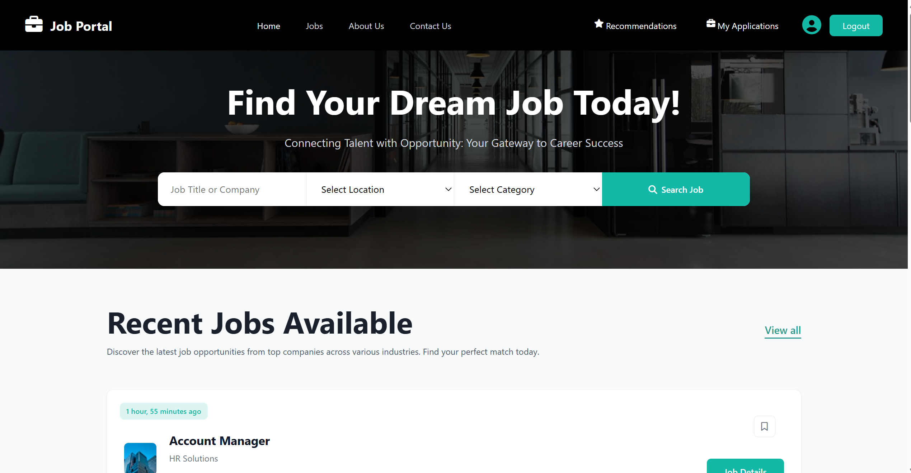

<div align="center">

# 🚀 JobPortal 2025

### **Modern AI-Powered Job Portal Platform**

[](https://www.djangoproject.com/)
[](https://www.python.org/)
[](https://www.mysql.com/)
[](https://redis.io/)
[](LICENSE)
[]()

**A comprehensive, enterprise-grade job portal platform built with Django, featuring AI-powered job recommendations and complete employer/employee management system.**

[Features](#-key-features) • [Demo](#-live-demo) • [Installation](#-quick-start) • [Documentation](#-documentation) • [API](#-api-documentation)

---

</div>

## 📋 Table of Contents

- [✨ Key Features](#-key-features)
- [🎯 Live Demo](#-live-demo)
- [🚀 Quick Start](#-quick-start)
- [📚 Documentation](#-documentation)
- [🔌 API Documentation](#-api-documentation)
- [🏗️ Architecture](#️-architecture)
- [🛠️ Tech Stack](#️-tech-stack)
- [📦 Project Structure](#-project-structure)
- [🤝 Contributing](#-contributing)
- [📄 License](#-license)

---

## ✨ Key Features

### 🎨 **For Job Seekers**

<div align="center">

| Feature | Description |
|---------|-------------|
| 🤖 **AI-Powered Recommendations** | Get personalized job matches using Hugging Face Sentence Transformers |
| 🔍 **Advanced Job Search** | Filter by skills, location, salary, work mode, and more |
| 📊 **Application Tracking** | Track application status with real-time updates |
| 💼 **Profile Management** | Complete profile with skills, experience, education, and social links |
| 🔔 **Smart Notifications** | Get notified about new matches, status updates, and messages |

</div>

### 🏢 **For Employers**

<div align="center">

| Feature | Description |
|---------|-------------|
| 📝 **Job Posting Management** | Create, edit, and manage job postings with rich descriptions |
| 👥 **Candidate Management** | View profiles, download resumes, and manage applications |
| 📈 **Analytics Dashboard** | Track views, applications, and engagement metrics |
| 💬 **Direct Messaging** | Communicate with candidates directly through the platform |
| ✅ **Application Pipeline** | Manage candidates through stages: Applied → Shortlisted → Interview → Hired |
| 🎯 **Advanced Filtering** | Filter applicants by skills, experience, education, and status |

</div>

### 👨‍💼 **Admin Features**

<div align="center">

| Feature | Description |
|---------|-------------|
| 🎨 **Beautiful Jazzmin Admin** | Modern, responsive admin interface |
| 📊 **Analytics Dashboard** | Comprehensive site analytics and metrics |
| 🔐 **User Management** | Approve, suspend, or ban user accounts |
| ✅ **Company Verification** | Verify and approve employer accounts |
| 🛡️ **Content Moderation** | Manage jobs, flag spam, and maintain quality |
| ⚙️ **SEO Management** | Control meta tags and homepage content |

</div>

---

## 🎯 Live Demo

### 🖥️ **Screenshot**

<div align="center">



*Homepage featuring hero section with job search and recent job listings*

</div>

### 🎬 **Demo Video**

<div align="center">

**Watch the full demo video to see all features in action!**

<video width="100%" style="max-width: 800px; border-radius: 8px;" controls>
  <source src="demo/Screen Recording 2025-12-14 123645.mp4" type="video/mp4">
  Your browser does not support the video tag. 
  <a href="demo/Screen Recording 2025-12-14 123645.mp4">Download the video here</a>
</video>

<br>

**[📹 Direct Download](demo/Screen Recording 2025-12-14 123645.mp4)**

</div>


### 🔑 **Demo Credentials**

**Job Seeker Account:**
- Email: `demo@jobseeker.com`
- Password: `Demo123!`

**Employer Account:**
- Email: `demo@employer.com`
- Password: `Demo123!`

**Admin Panel:**
- URL: `/admin/`
- Email: `admin@jobportal.com`
- Password: `Admin123!`

---

## 🚀 Quick Start

### 📋 Prerequisites

- Python 3.8+
- MySQL 8.0+ or SQLite (for development)
- Redis (optional, for caching)
- pip and virtualenv

### ⚡ Installation

```bash
# 1. Clone the repository
git clone https://github.com/yourusername/job_portal2025.git
cd job_portal2025

# 2. Create virtual environment
python -m venv venv

# On Windows
venv\Scripts\activate

# On Linux/Mac
source venv/bin/activate

# 3. Install dependencies
pip install -r requirements.txt

# 4. Create .env file
cp .env.example .env
# Edit .env with your configuration

# 5. Setup database
mysql -u root -p
CREATE DATABASE job_portal_db CHARACTER SET utf8mb4 COLLATE utf8mb4_unicode_ci;

# 6. Run migrations
python manage.py makemigrations
python manage.py migrate

# 7. Create superuser
python manage.py createsuperuser

# 8. Collect static files
python manage.py collectstatic

# 9. Run development server
python manage.py runserver
```

Visit `http://127.0.0.1:8000` to see the application!

### 🔧 Environment Variables

Create a `.env` file in the root directory:

```env
# Django Settings
SECRET_KEY=your-secret-key-here
DEBUG=True
ALLOWED_HOSTS=localhost,127.0.0.1

# Database Configuration
DB_NAME=job_portal_db
DB_USER=root
DB_PASSWORD=your-password
DB_HOST=localhost
DB_PORT=3306

# Redis Configuration (Optional)
REDIS_HOST=localhost
REDIS_PORT=6379
REDIS_DB=0

# Email Configuration
EMAIL_HOST=smtp.gmail.com
EMAIL_PORT=587
EMAIL_USE_TLS=True
EMAIL_HOST_USER=your-email@gmail.com
EMAIL_HOST_PASSWORD=your-app-password
DEFAULT_FROM_EMAIL=noreply@jobportal.com

# AI Model Configuration
AI_RECOMMENDATION_MODEL=sentence-transformers/all-mpnet-base-v2
```

---

## 📚 Documentation

### 📖 **User Guides**

- [Job Seeker Guide](docs/job-seeker-guide.md) - Complete guide for job seekers
- [Employer Guide](docs/employer-guide.md) - Complete guide for employers
- [Admin Guide](docs/admin-guide.md) - Admin panel documentation

### 🤖 **AI Features**

- [AI Recommendations System](AI_RECOMMENDATIONS.md) - Detailed documentation on AI-powered job recommendations
- [Hugging Face Integration](HUGGING_FACE_AI_GUIDE.md) - Guide to AI model integration

### 🔧 **Technical Documentation**

- [API Documentation](#-api-documentation) - REST API endpoints
- [Architecture Overview](#️-architecture) - System architecture
- [Deployment Guide](docs/deployment.md) - Production deployment instructions

---

## 🔌 API Documentation

### 🔐 Authentication Endpoints

| Method | Endpoint | Description |
|--------|----------|-------------|
| `POST` | `/api/auth/register/` | Register new user (Job Seeker/Employer) |
| `POST` | `/api/auth/login/` | User login |
| `POST` | `/api/auth/logout/` | User logout |
| `POST` | `/api/auth/verify-email/` | Verify email address |
| `POST` | `/api/auth/reset-password/` | Request password reset |
| `POST` | `/api/auth/reset-password-confirm/` | Confirm password reset |

### 💼 Job Endpoints

| Method | Endpoint | Description |
|--------|----------|-------------|
| `GET` | `/api/jobs/` | List all active jobs |
| `GET` | `/api/jobs/search/` | Search jobs with filters |
| `GET` | `/api/jobs/<id>/` | Get job details |
| `POST` | `/api/jobs/<id>/apply/` | Apply to a job |
| `POST` | `/api/jobs/<id>/save/` | Save/unsave a job |
| `GET` | `/api/jobs/recommendations/` | Get AI-powered job recommendations |

### 📋 Application Endpoints

| Method | Endpoint | Description |
|--------|----------|-------------|
| `GET` | `/api/applications/` | List user's applications |
| `GET` | `/api/applications/<id>/` | Get application details |
| `POST` | `/api/applications/<id>/message/` | Send message to recruiter/candidate |
| `PATCH` | `/api/applications/<id>/status/` | Update application status |

### 🏢 Company Endpoints

| Method | Endpoint | Description |
|--------|----------|-------------|
| `GET` | `/api/companies/` | List all companies |
| `GET` | `/api/companies/<id>/` | Get company details |
| `GET` | `/api/companies/<id>/jobs/` | Get company's job postings |

### 👤 Profile Endpoints

| Method | Endpoint | Description |
|--------|----------|-------------|
| `GET` | `/api/profile/` | Get user profile |
| `PATCH` | `/api/profile/` | Update user profile |
| `POST` | `/api/profile/resume/` | Upload resume |

---

## 🏗️ Architecture

```
┌─────────────────────────────────────────────────────────────┐
│                      Frontend Layer                         │
│  ┌──────────────┐  ┌──────────────┐  ┌──────────────┐     │
│  │   Bootstrap  │  │  JavaScript  │  │   FontAwesome│     │
│  └──────────────┘  └──────────────┘  └──────────────┘     │
└─────────────────────────────────────────────────────────────┘
                            │
┌─────────────────────────────────────────────────────────────┐
│                    Django Application Layer                 │
│  ┌──────────────┐  ┌──────────────┐  ┌──────────────┐     │
│  │   Accounts   │  │     Jobs     │  │ Applications │     │
│  └──────────────┘  └──────────────┘  └──────────────┘     │
│  ┌──────────────┐  ┌──────────────┐  ┌──────────────┐     │
│  │  Companies   │  │Notifications │  │     Core     │     │
│  └──────────────┘  └──────────────┘  └──────────────┘     │
└─────────────────────────────────────────────────────────────┘
                            │
┌─────────────────────────────────────────────────────────────┐
│                      AI/ML Layer                            │
│  ┌──────────────────────────────────────────────────────┐  │
│  │  Hugging Face Sentence Transformers                  │  │
│  │  - Resume Analysis                                   │  │
│  │  - Job Matching                                      │  │
│  │  - Semantic Similarity                               │  │
│  └──────────────────────────────────────────────────────┘  │
└─────────────────────────────────────────────────────────────┘
                            │
┌─────────────────────────────────────────────────────────────┐
│                    Data Layer                                │
│  ┌──────────────┐  ┌──────────────┐  ┌──────────────┐     │
│  │    MySQL     │  │    Redis     │  │   Media      │     │
│  │  (Primary)   │  │   (Cache)    │  │  (Files)     │     │
│  └──────────────┘  └──────────────┘  └──────────────┘     │
└─────────────────────────────────────────────────────────────┘
```

---

## 🛠️ Tech Stack

### **Backend**
-  Django 4.2.7 - Web framework
-  Django REST Framework 3.14.0 - API framework
-  Django Jazzmin 2.6.0 - Admin interface

### **Database & Cache**
-  MySQL 8.0+ - Primary database
-  Redis 5.0+ - Caching layer

### **AI/ML**
-  PyTorch 2.0+ - Deep learning framework
-  Sentence Transformers 2.2.2 - AI recommendations
-  Scikit-learn 1.3.0 - ML utilities

### **File Processing**
-  ReportLab 4.0.7 - PDF generation
-  PyPDF2 3.0.1 - PDF processing
-  python-docx 1.1.0 - DOCX processing

### **Frontend**
-  Bootstrap 5.3.2 - CSS framework
-  Font Awesome 6.4.0 - Icons

### **Other Tools**
-  Celery 5.3.4 - Task queue
-  Pillow 10.4.0+ - Image processing

---

## 📦 Project Structure

```
job_portal2025/
├── accounts/                 # User authentication and profiles
│   ├── models.py            # User, JobSeekerProfile, SavedJob
│   ├── views.py             # Auth views, profile management
│   ├── oauth_views.py       # OAuth integration (Google)
│   └── serializers.py       # API serializers
│
├── companies/               # Company/Employer management
│   ├── models.py            # Company, Recruiter models
│   ├── views.py             # Employer dashboard, job management
│   └── serializers.py       # API serializers
│
├── jobs/                    # Job postings and search
│   ├── models.py            # Job, JobView, JobRecommendation
│   ├── views.py             # Job search, detail, apply
│   ├── ai_recommender.py    # AI-powered job recommendations
│   └── utils.py             # Job recommendation algorithm
│
├── applications/            # Job applications
│   ├── models.py            # Application, ApplicationMessage
│   ├── views.py             # Application tracking, messaging
│   └── serializers.py       # API serializers
│
├── notifications/           # User notifications
│   └── models.py            # Notification model
│
├── core/                    # Site settings and analytics
│   ├── models.py            # SiteSettings, Analytics
│   └── admin_views.py       # Admin analytics dashboard
│
├── job_portal/              # Project settings
│   ├── settings.py           # Django configuration
│   ├── urls.py              # URL routing
│   └── wsgi.py              # WSGI configuration
│
├── templates/               # HTML templates
│   ├── base.html            # Base template
│   ├── accounts/            # Auth templates
│   ├── jobs/                # Job templates
│   ├── companies/           # Company templates
│   └── applications/        # Application templates
│
├── static/                  # Static files (CSS, JS, images)
├── media/                   # User uploaded files
├── requirements.txt         # Python dependencies
├── manage.py                # Django management script
└── README.md                # This file
```

---

## 🎯 Key Features in Detail

### 🤖 AI-Powered Job Recommendations

The platform uses **Hugging Face Sentence Transformers** to provide intelligent job recommendations:

- **Semantic Matching**: Understands meaning, not just keywords
- **Resume Analysis**: Extracts and analyzes resume content (PDF/DOCX)
- **Similarity Scoring**: Calculates cosine similarity between resumes and job descriptions
- **Automatic Updates**: Recommendations update when you upload a new resume
- **Fallback System**: Falls back to rule-based matching if AI is unavailable

**Model**: `sentence-transformers/all-mpnet-base-v2` (configurable)

### 🔍 Advanced Search & Filters

- **Full-Text Search**: Search by job title, description, skills
- **Advanced Filters**: 
  - Work mode (Remote/Hybrid/Onsite)
  - Job type (Full-time/Part-time/Internship/Contract)
  - Salary range
  - Experience level
  - Location
  - Company name

### 📊 Analytics & Insights

**For Employers:**
- Job views and application counts
- Candidate pipeline visualization
- Performance metrics per job posting

**For Admins:**
- User growth statistics
- Job posting analytics
- Application trends
- Top companies and most viewed jobs

---

## 🤝 Contributing

We welcome contributions! Please follow these steps:

1. Fork the repository
2. Create a feature branch (`git checkout -b feature/AmazingFeature`)
3. Commit your changes (`git commit -m 'Add some AmazingFeature'`)
4. Push to the branch (`git push origin feature/AmazingFeature`)
5. Open a Pull Request

### 📝 Contribution Guidelines

- Follow PEP 8 style guide for Python code
- Write clear commit messages
- Add tests for new features
- Update documentation as needed

---

## 📄 License

This project is licensed under the MIT License - see the [LICENSE](LICENSE) file for details.

---

## 🙏 Acknowledgments

- [Django](https://www.djangoproject.com/) - The web framework
- [Django Jazzmin](https://github.com/farridav/django-jazzmin) - Beautiful admin interface
- [Hugging Face](https://huggingface.co/) - AI models and transformers
- [Bootstrap](https://getbootstrap.com/) - CSS framework
- [Font Awesome](https://fontawesome.com/) - Icons

---

<div align="center">

### ⭐ Star this repo if you find it helpful!

**Made with ❤️ using Django and AI**

[Report Bug](https://github.com/yourusername/job_portal2025/issues) • [Request Feature](https://github.com/yourusername/job_portal2025/issues) • [Documentation](docs/)

</div>
